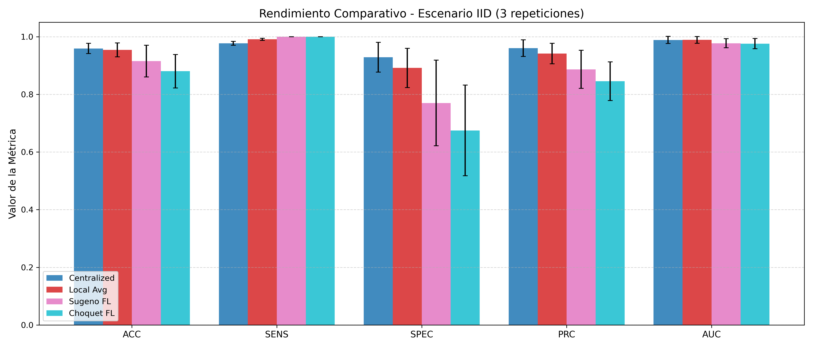
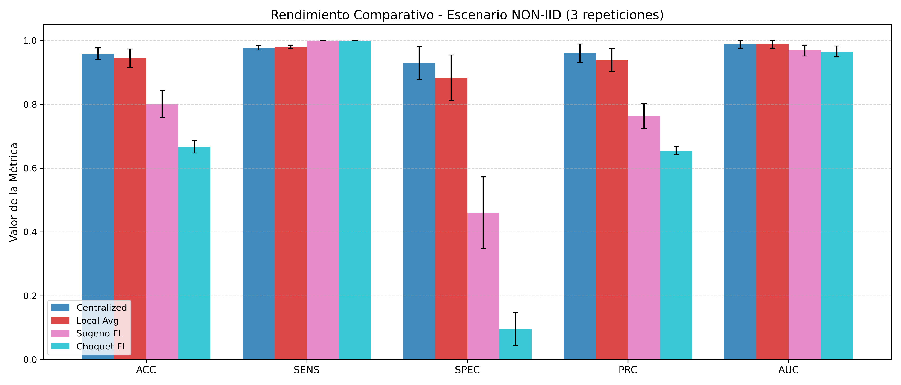

# GeneralizedInspiredFuzzyIntegrals

Implementation of some generalized inspired fuzzy integrals 

## Implemented the paper: Federated learning with the choquet integral as aggregation method

Pekala, B., Wilbik, A., Szkola, J., Dyczkowski, K., & Zywica, P. (2024). Federated Learning with the Choquet Integral as Aggregation Method. 
In 2024 IEEE International Conference on Fuzzy Systems, FUZZ-IEEE 2024 - Proceedings IEEE. 
https://doi.org/10.1109/FUZZ-IEEE60900.2024.10611748

https://cris.maastrichtuniversity.nl/ws/portalfiles/portal/219701647/Wilbik-2024-Federated-learning-with-the-Choquet.pdf

Related works:

## (a, b)-FG-functionals: a generalization of the Sugeno integral with floating domains in arbitrary closed real intervals and its applications

da Cruz Asmus, T., Lucca, G., Marco-Detchart, C., Arellano, J., Bustince, H., & Dimuro, G. P. (2026). (a, b)-FG-functionals: a generalization of the Sugeno integral with floating domains in arbitrary closed real intervals and its applications. Information Fusion, 134, 104315.

https://doi.org/10.1016/j.inffus.2026.104315

https://academica-e.unavarra.es/entities/publication/14ceaa66-a1da-42af-a28b-371a6af39b0c

## Choquet inspired functions and their application to feature reduction in convolutional neural networks

Arellano, J., Bustince, H., Bedregal, B., Riera, J. V., Lucca, G., Horanská, Ľ., ... & Dimuro, G. P. (2026). -Choquet inspired functions and their application to feature reduction in convolutional neural networks. Information Sciences, 123991.

https://www.sciencedirect.com/science/article/pii/S0020025526009229

Some preliminary results:

## License: GPL v3

[LICENSE](LICENSE)
